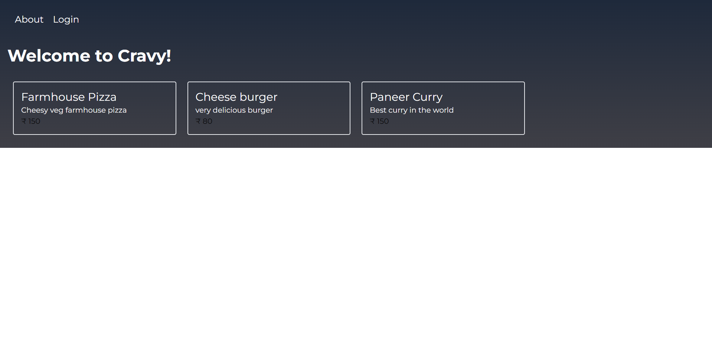
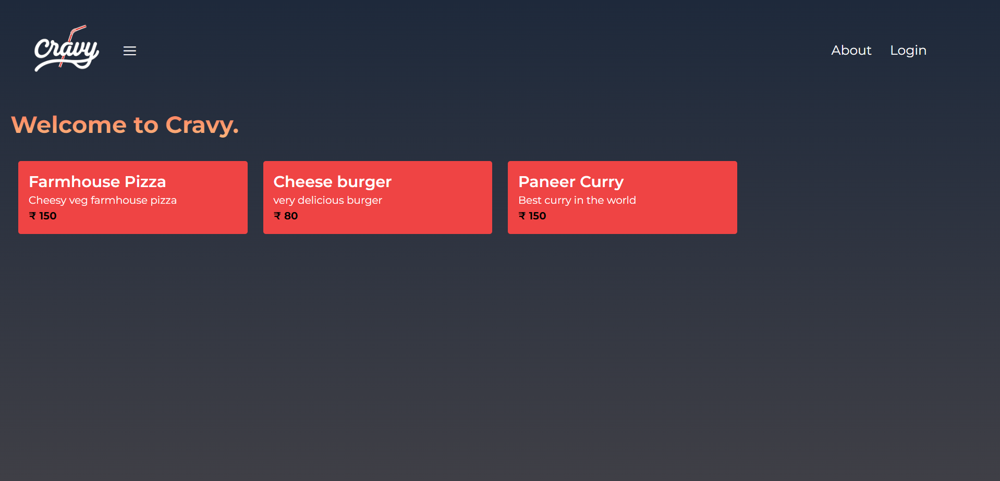
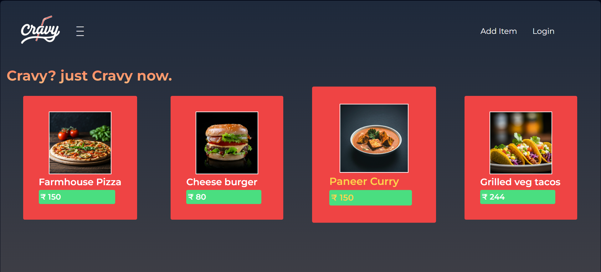
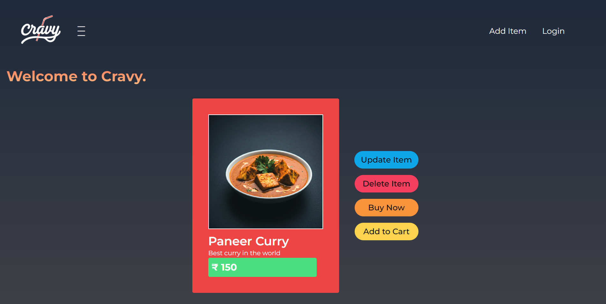
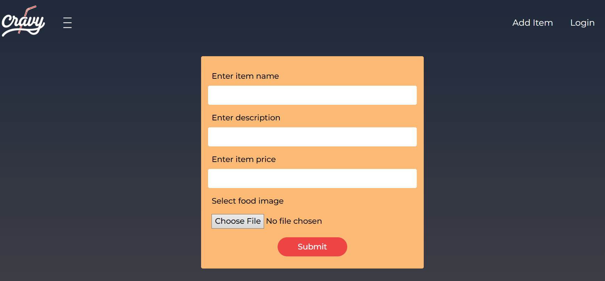
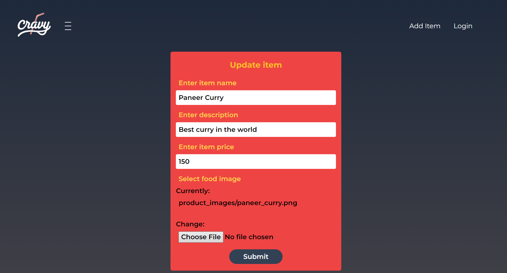
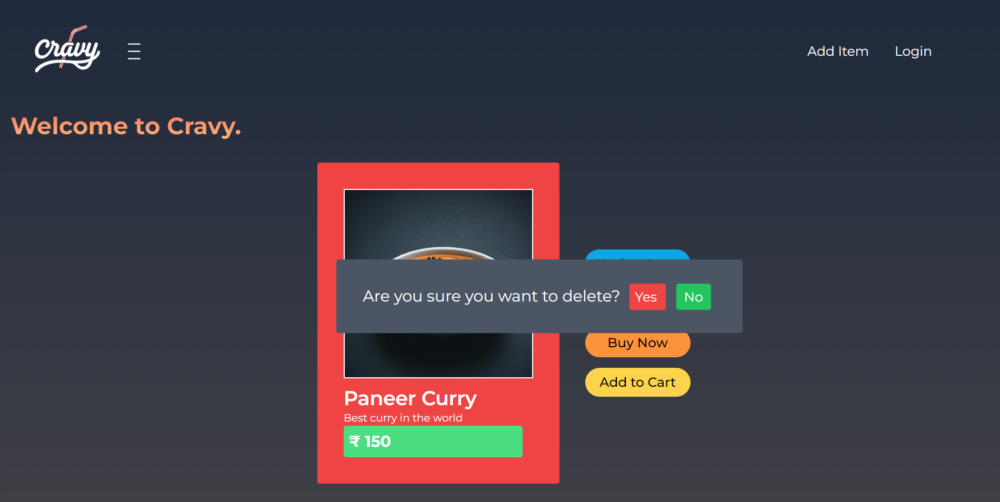

# Cravy 🍴

**Cravy** is an online food store built with Django, JavaScript, and Tailwind CSS. It features a sleek, responsive design and provides a seamless user experience for exploring and adding food items to the catalog.

---

## 🚀 Features
- **Home Page**: A visually appealing index page showcasing food items.
- **Item Details**: A dedicated page for viewing details of individual items.
- **Add Item**: Functionality to add new items to the food store.
- **Responsive Design**: Optimized for all screen sizes using Tailwind CSS.
- **Interactive UX**: JavaScript-enhanced features for a smooth user experience.

---

## 🛠️ Tech Stack
- **Backend**: Django (Python)
- **Frontend**: JavaScript, HTML, Tailwind CSS
- **Database**: SQLite (default) or PostgreSQL (configurable)
- **Design**: Responsive and modern UI with Tailwind CSS

---
##  Future Enhancements
- Add a Cart page for managing selected items.
- Implement Checkout functionality with payment integration.
- Add User Authentication for personalized experiences.
- Enable Search and Filter options for the item catalog.
- Include Order History for registered users.

## Current Progress
- 
- 
- 

- 

- 
- 
- 

## Project structure
📂 .git          
    📄 COMMIT_EDITMSG
    📄 FETCH_HEAD
    📄 HEAD
    📄 ORIG_HEAD
    📄 config
    📄 description
    📂 hooks
    📄 index
    📂 info
    📂 logs
    📂 objects
    📂 refs
📄 README.md
📄 cheese_burger.jpg
📂 cravy
    📄 __init__.py
    📂 __pycache__
    📄 asgi.py
    📄 settings.py
    📄 urls.py
    📄 wsgi.py
📄 dashboard.png
📄 db.sqlite3
📄 farmhouse_pizza.png
📂 food
    📄 __init__.py
    📂 __pycache__
    📄 admin.py
    📄 apps.py
    📄 forms.py
    📂 migrations
    📄 models.py
    📂 static
    📂 templates
    📄 tests.py
    📄 urls.py
    📄 views.py
📄 grilledveg_tacos.png
📄 logo3.png
📄 manage.py
📂 media
    📄 placeholder.png
    📂 product_images
    📄 profile.png
    📂 profile_pics
    📂 screenshots
📄 paneer_curry.png
📄 profile.png
📂 static
    📂 admin
    📄 logo.png
    📄 logo2.png
    📄 logo3.png
📂 users
    📄 __init__.py
    📂 __pycache__
    📄 admin.py
    📄 apps.py
    📄 forms.py
    📂 migrations
    📄 models.py
    📄 signals.py
    📂 templates
    📄 tests.py
    📄 urls.py
    📄 views.py

## Contact
- Email: ronhartforddelta19@gmail.com
- GitHub: chriswilder3
