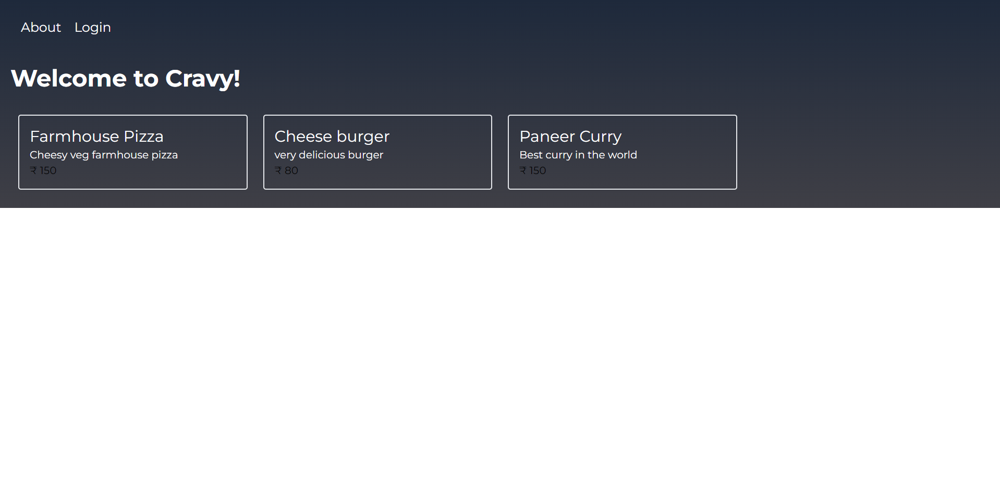
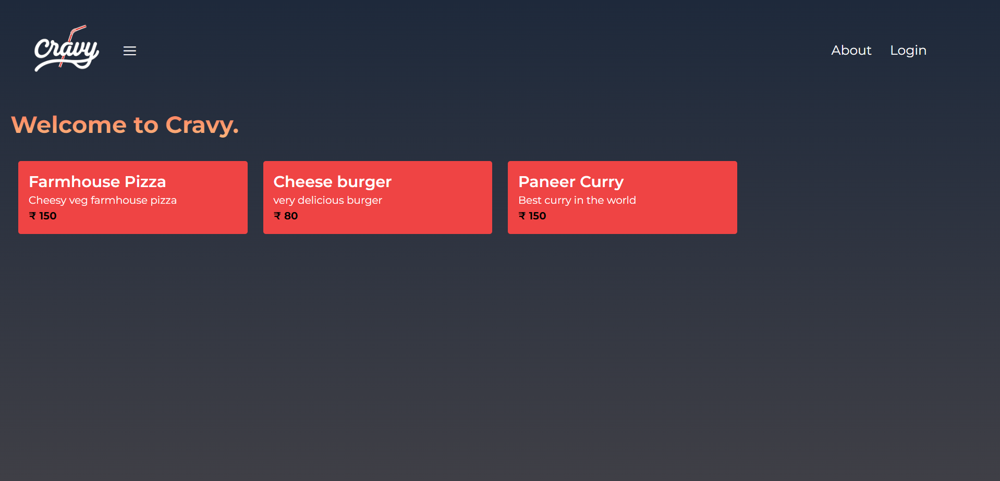
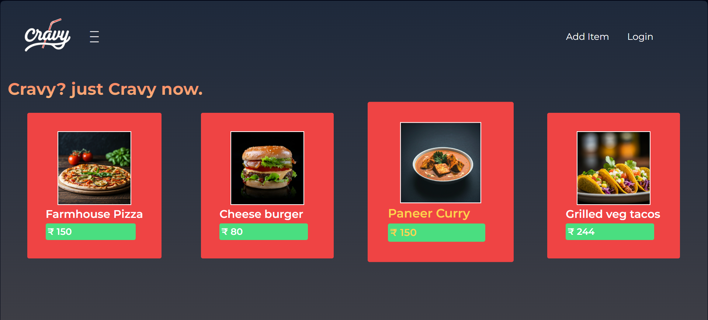
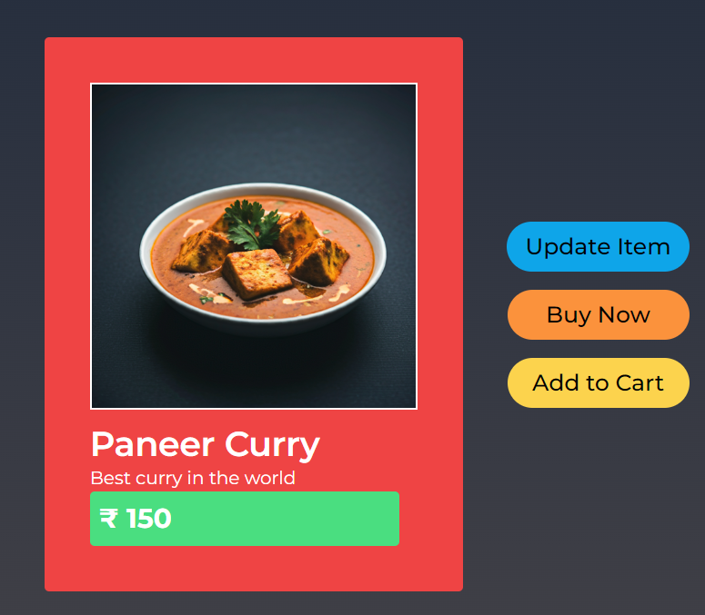
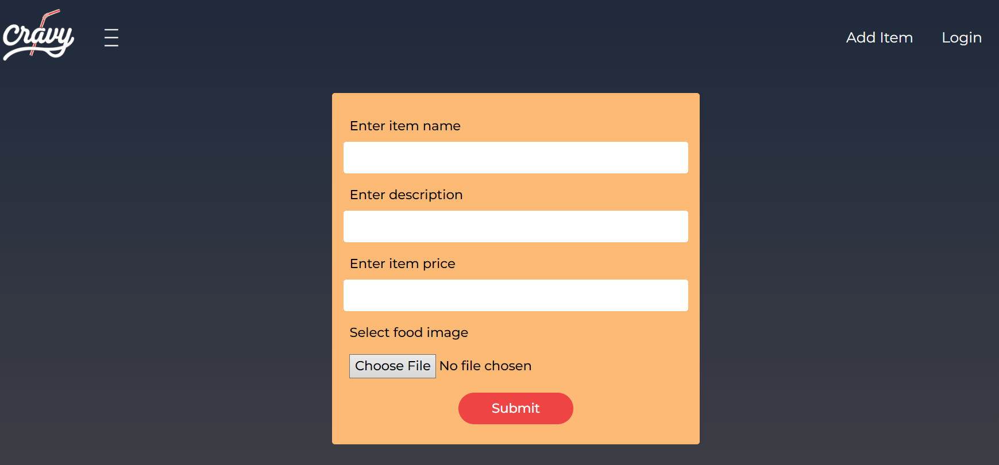
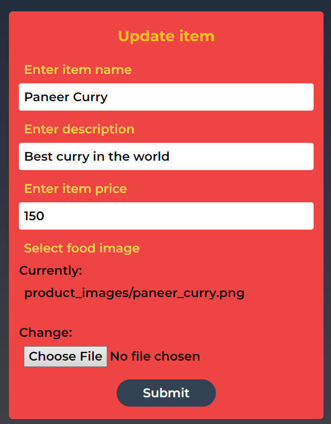

# Cravy 🍴

**Cravy** is an online food store built with Django, JavaScript, and Tailwind CSS. It features a sleek, responsive design and provides a seamless user experience for exploring and adding food items to the catalog.

---

## 🚀 Features
- **Home Page**: A visually appealing index page showcasing food items.
- **Item Details**: A dedicated page for viewing details of individual items.
- **Add Item**: Functionality to add new items to the food store.
- **Responsive Design**: Optimized for all screen sizes using Tailwind CSS.
- **Interactive UX**: JavaScript-enhanced features for a smooth user experience.

---

## 🛠️ Tech Stack
- **Backend**: Django (Python)
- **Frontend**: JavaScript, HTML, Tailwind CSS
- **Database**: SQLite (default) or PostgreSQL (configurable)
- **Design**: Responsive and modern UI with Tailwind CSS

---
##  Future Enhancements
- Add a Cart page for managing selected items.
- Implement Checkout functionality with payment integration.
- Add User Authentication for personalized experiences.
- Enable Search and Filter options for the item catalog.
- Include Order History for registered users.

## Current Progress
- 
- 
- 

- 

- 
- 

## Contact
- Email: ronhartforddelta19@gmail.com
- GitHub: chriswilder3
